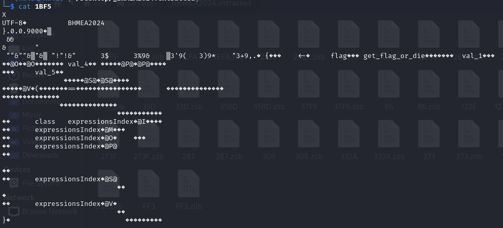
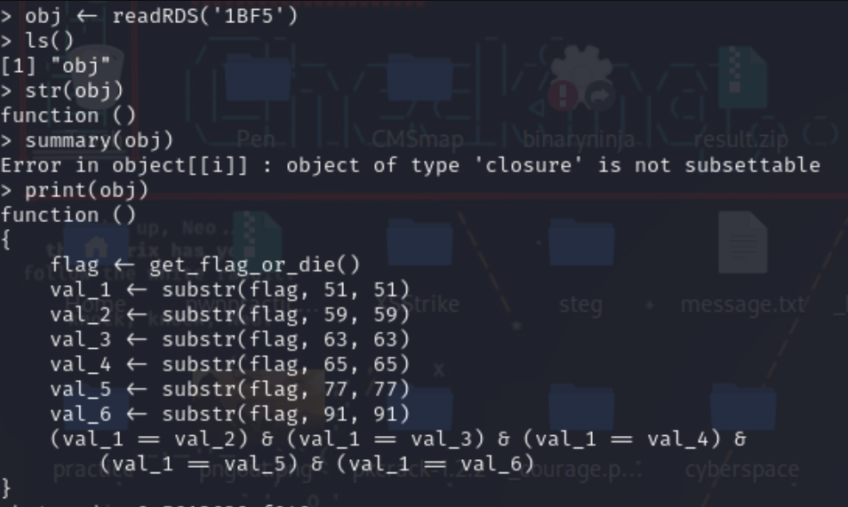

# BlackHatMEA 2024 - RD What Now?


I have some files missing but I think I can figure it out anyways.


## Explanation

Typical "Z3 solver/whole lotta conditions" challenge, but written in R.

We start with a file that contains a bunch of zlib files. We can use binwalk to extract these files.

The files contain a bunch of non sense and couple strings like 0.0.9000, quick google search and we find that it has something to do with R :



Now apparently in R you can read these "rds" files :



And there you go, a bunch of functions that tell you what each character in the flag string should equal to, you can use a z3solver script to get the flag...I don't have a script because I manually calculated everything by hand.

Then there's the big xor function

```R
function () 
{
    if (exists("flag", envir = .GlobalEnv)) {
        flag_value <- get("flag", envir = .GlobalEnv)
        if (is.character(flag_value)) {
            xor_key <- "BHMEAISTHEBESTCTFEVERBETTERTHANALLOFTHEOTHERCTF"
            key_length <- nchar(xor_key)
            flag_length <- nchar(flag_value)
            if (flag_length != key_length) {
                xor_key <- substr(rep(xor_key, length.out = ceiling(flag_length/key_length)), 
                  1, flag_length)
            }
            xor_result <- sapply(1:flag_length, function(i) {
                flag_char <- substr(flag_value, i, i)
                key_char <- substr(xor_key, i, i)
                int_val <- as.integer(charToRaw(flag_char))
                xor_val <- as.integer(charToRaw(key_char))
                xored_val <- bitwXor(int_val, xor_val)
                as.raw(xored_val)
            })
            return(paste0(xor_result, collapse = ""))
        }
    }
    else {
        system("echo 'try better next time'")
    }
}
```

Run the function and get the flag (or rewrite it in another language if you want)

(Keep in mind the non xored flag should be in hexadecimal and not as a string for this xor operation to work.) 


