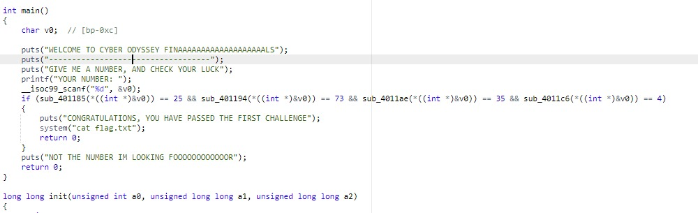

# Cyber Odyssey 2024 Finals - Full Writeup


## Intro

Dolphin supremacy ğŸ¬ğŸ¬ğŸ¬ğŸ¬ğŸ¬ğŸ¬ğŸ¬ğŸ¬ğŸ¬ğŸ¬ğŸ¬ğŸ¬ğŸ¬ğŸ¬ğŸ¬ğŸ¬ğŸ¬ğŸ¬ğŸ¬ğŸ¬ğŸ¬

## BashCage - Misc

### Description

I heard you can execute bash commands using only special characters. Show me what you got!

### Explanation

Inspired by https://medium.com/@philomath213/securinets-ctf-quals-2019-special-revenge-6c923d5b900b and https://gist.github.com/dimasma0305/c3d5d3cac71c8240a491a3010f2372b8 

I pretty much had to write "sh" (which would open a shell) knowing that : 

```sh
"0": "${#}",
"1": "${##}",
"2": "$((${##}<<$((${##}))))",
"3": "$((${##}<<$((${##}))^${##}))",
"4": "$((${##}<<$((${##}))<<$((${##}))))",
"5": "$((${##}<<$((${##}))<<$((${##}))^${##}))",
"6": "$(($((${##}<<$((${##}))^${##}))<<${##}))",
"7": "$(($((${##}<<$((${##}))^${##}))<<${##}^${##}))",
"8": "$((${##}<<$((${##}))<<$((${##}))<<$((${##}))))",
"9": "$((${##}<<$((${##}))<<$((${##}))<<$((${##}))^${##}))",
```

We can call a shell by doing : ```$'\163'$'\150'```

By trial and error I ended up with this "payload" where I believe I convert both 163 and 150 to binary : 

```sh
$'\\$(($((${##}<<${##}))#${##}${#}${##}${#}${#}${#}${##}${##}))'$'\\$(($((${##}<<$((${##}))))#${##}${#}${#}${##}${#}${##}${##}${#}))'
```

## tskhinat - Rev

### Description


### Explanation

Main was easy to understand



Had to take each function, turn it into an equation and use z3 solver to solve this system : 

```python
from z3 import *

def solve_bitwise_constraints():
    # Create a bitvector variable 'a' of 32 bits
    a = BitVec('a', 32)
    
    # Define constraints
    constraints = [
        # a & 0x19 = 25
        a & 0x19 == 25,
        
        # (a & 0x4900) >> 8 = 73
        Extract(15, 0, a & 0x4900) >> 8 == 73,
        
        # a1 << 8 >> 24 = 35
        # Note: a1 is derived from a
        (a << 8 >> 24) == 35,
        
        # HIBYTE(a1) = 4
        # High byte of a1, which is equivalent to (a1 >> 24)
        Extract(31, 24, a) == 4
    ]
    
    # Create a solver and add constraints
    solver = Solver()
    for constraint in constraints:
        solver.add(constraint)
    
    # Check if constraints are satisfiable
    if solver.check() == sat:
        # Get the model (solution)
        model = solver.model()
        print("Solution found:")
        print(f"a = {model[a]}")
        print(f"a (hex) = 0x{model[a].as_long():08x}")
        
        # Verify constraints
        a_val = model[a].as_long()
        print("\nVerification:")
        print(f"a & 0x19 = {a_val & 0x19}")
        print(f"(a & 0x4900) >> 8 = {(a_val & 0x4900) >> 8}")
        print(f"a1 << 8 >> 24 = {(a_val << 8) >> 24}")
        print(f"HIBYTE(a1) = {(a_val >> 24) & 0xFF}")
    else:
        print("No solution exists.")

# Run the solver
solve_bitwise_constraints()
```

## ChasSamBly - Rev

### Description

Slk slk

### Explanation 

I think the only thing I did was unpack the challenge ?

### GPT Explanation

Kudos to chat gpt o1, i'm not even gonna bother explaining this. Do pilots explain what their autopilot's doing ??? No, and they're flying a plane, in the air, meanwhile if you're a programmer and you use chat gpt that makes you less of a programmer ? At least I'm the guy here who first-blooded this challenge...

```
**Short Answer:** The decrypted flag is `ODYSSEY{gosolveityourself}`.

**Detailed Explanation:**

You have provided a timestamp (`1734120346`) and an encrypted set of bytes. From the given code, we know how the encryption works and can reverse it to recover the original plaintext.

**Step-by-step Reasoning:**

1. **Identify the key generation:**
   The code that generates the key byte (`v4`) is:
   c
   *a1 = (v3 ^ 0x5A) - 99 + 42;
   
   Here, `v3` is the current time. Given:
   
   v3 = 1734120346
   
   First, compute `(v3 ^ 0x5A)`:
   
   - Convert `0x5A` to decimal: `0x5A = 90`.
   - XOR with v3:
     `1734120346 ^ 90` = some large integer. But since we ultimately store into a byte, let's focus on the final modulo 256 result.
   
   Let's find the last 8 bits of `v3`:

   `v3 = 1734120346` in hex is `0x675C939A`.

   The last byte of `v3` is `0x9A`.
   Now XOR with `0x5A`:
   
   0x9A ^ 0x5A = 0xC0
   
   
   So `(v3 ^ 0x5A) ≡ 0xC0 (mod 256) = 192 decimal`.
   
   Now apply `- 99 + 42`:
   
   192 - 99 = 93
   93 + 42 = 135
   
   
   In hexadecimal, 135 = 0x87.
   
   Thus the key byte `a3` (stored in `v4`) = `0x87`.

2. **Encryption logic:**
   The encryption for each character `plain[i]` is:
   c
   // given key a3
   temp = a3 ^ plain[i];
   temp = temp + 69;
   enc[i] = a3 ^ temp;
   
   
   To decrypt, we reverse these steps:
   
   Given `enc[i]`, we do:
   c
   temp = a3 ^ enc[i];
   temp = temp - 69;
   plain[i] = a3 ^ temp;
   
   
   All operations are done modulo 256.

3. **Decrypting each byte:**
   We have the encrypted bytes:
   
   0x8A 0x8F 0xA4 0x9E 0x9E 0x80 0xA4 0xC6 0x7E 0xAC
   0x9E 0xC4 0x9A 0x8C 0xBE 0xBE 0x7E 0xA8 0x8D 0xB7
   0xC4 0x9A 0x9D 0x7E 0xB1 0xB8
   
   
   Using `a3 = 0x87`, decrypt each byte:

   Example for the first byte, `0x8A`:
   - `temp = a3 ^ enc[i] = 0x87 ^ 0x8A = 0x0D (13 decimal)`
   - `temp - 69 = 13 - 69 = -56 mod 256 = 200 (0xC8)`
   - `plain[i] = a3 ^ 0xC8 = 0x87 ^ 0xC8 = 0x4F = 'O'`

   Doing this for all characters, you end up with:
   
   O D Y S S E Y { redacted of course :) }
   

4. **Final Decrypted Flag:**
   
   ODYSSEY{nuhuh}
   

**Conclusion:**
The original message hidden behind the given timestamp and encrypted data is the flag:  
**`ODYSSEY{}`**
```

## tke3ki3 - Rev

### Description

dkachi mke3ke3

### Explanation

For this one I had a half-assed solve script and I needed to manually check which letters were wrong : 

```
from z3 import *

# Initialize the solver
s = Solver()

# Define the byte_404100 array with signed interpretation
byte_404100 = [
    0xFF, ord('^'), 0xE2, 0xFE, 0x8B, 0xAE, 0xC3, 0xFF, 0xDA, ord('a'),
    0x89, ord('s'), 0x1B, 0x0F, ord('h'), 0xAF, 0x9E, ord('f'), 0xE8, ord('<'),
    0x98, 0xDA, 0x84, 0xD6, ord('-'), ord('('), ord('j'), 0xF3, 0x14, 0xA2,
    0xE4, 0xB5, ord('J'), ord('K'), 0xB7, 0x04, 0x1C, 0xF9, 0x16, ord('R'),
    0xC0, 0xB1, 0x12, 0xE1, 0x94, 0x84, 0xB0, 0x06, 0x86, ord('n'),
    0xFF, 0xF9, 0x80, ord('['), 0x94, 0xB6, 0x97, 0xF0, 0x16, 0x95,
    0xFC, 0xCD, ord('o'), 0xA4, ord('k'), 0xC3, 0x9E, ord('J'), ord('<'), 0xD3,
    ord('C'), 0xA5, 0x81, 0xE3, ord('&'), ord('-'), ord('$'), 0xEB, 0x9B, 0x02,
    ord('*'), 0xD8, 0xD6, 0xBA, ord('_'), 0x87, 0xF6, ord("'"), ord('!'), ord('a'),
    0xA5, 0xC6, 0xC0, 0xDE, 0x9E, 0xFF, ord('~'), ord('+'), 0x83, ord('U'),
    0xE0, ord('6'), ord('`'), ord(' '), 0x90, 0x15, 0x0C, 0x86, ord('='), 0x06,
    0x08, 0x8F, 0xA4, ord('}'), 0x7F, 0x92, 0xDA, 0x18, 0xC3, 0xAD,
    0xFD, 0xD6, 0xE0, ord('*'), 0xF8, ord('2'), 0xF3, ord('Q'), 0xB7, 0x1E,
    0xFA, ord('{'), 0x9C, 0xE1, 0x88, 0x84, 0xCB, ord('K'), 0xA9, 0xE2,
    ord('R'), ord('h'), 0xB9, 0x90, 0x80, ord('p'), ord('|'), ord('e'), 0x1E, 0xFA,
    ord('/'), 0x1C, ord('m'), 0xEA, ord('"'), ord('d'), ord('L'), 0xCB, ord('_'), ord('1'),
    ord('?'), 0xA4, 0xC7, 0x9B, 0x01, 0xF5, 0xE2, ord('P'), 0xF1, ord('X'),
    ord('?'), 0xC9, 0x95, 0x0F, 0x98, 0x9E, 0xAB, ord('v'), ord('T'), ord('U'),
    0xBD, 0x15, 0xEA, 0xA7, 0xE3, ord('1'), 0xA6, ord('"'), ord('='), 0xA4,
    0xFD, ord('w'), 0xB9, ord('y'), ord(']'), ord('!'), 0x9C, ord('!'), ord('4'), ord('g')
]
print(byte_404100[0])
# Convert byte_404100 to signed integers
byte_404100_signed = []
for b in byte_404100:
    if b >= 128:
        byte_404100_signed.append(b - 256)
    else:
        byte_404100_signed.append(b)

# Define the dword_404050 array
dword_404050 = [
    433, 376, 407, 213, 49, -60, 105, 378, 115, 465,
    254, 465, 158, 278, 50, 188, 248, 32, 471, 440,
    249, 246, 28, 203, 396, 184, 230, 154, 7, 201,
    419, 73, 165, 243, 353, 246, 92, 356, 479, 405,
    -46, 397, 16, 0
]

print(dword_404050[0])

# Initialize Z3 variables for each character
input_chars = []
for i in range(43):
    c = BitVec(f'c_{i}', 8)
    input_chars.append(c)

# Known prefix: "ODYSSEY{"
known_prefix = "ODYSSEY{"
for idx, char in enumerate(known_prefix):
    if idx <43:
        s.add(input_chars[idx] == ord(char))

# Initialize the solver
s = Solver()

# Define the constraints based on the verification logic
for i in range(43):
    c = input_chars[i]
    
    # Determine XOR key index based on i
    if i %4 ==0:
        xor_index = (2 *i) %150
    elif i %7 ==0:
        xor_index = (i +7) %100
    else:
        xor_index = (i *i) %200
    
    byte_xor = byte_404100_signed[xor_index]
    
    # Compute base
    base = c + byte_404100_signed[(i +5) %200] - byte_404100_signed[(i -3) %200] if i %5 ==0 else \
           (c + byte_404100_signed[(i *i) %200] if i %3 ==0 else c + byte_404100_signed[((i *i) +i) %200])
    
    # Compute final_val
    final_val = base ^ byte_xor
    
    # Define expected_final
    expected_final = dword_404050[i]
    
    # Since dword_404050 can be negative, handle two's complement
    if expected_final <0:
        expected_final += 2**32
    
    # Constraint: final_val == expected_final
    s.add(final_val == expected_final)
    
# Check if the constraints are satisfiable
if s.check() == sat:
    model = s.model()
    derived_input = ''.join([chr(model[input_chars[i]].as_long()) for i in range(43)])
    print("Derived Input String:")
    print(derived_input)
else:
    print("No solution found. There might be inconsistencies in the data or the inversion formula.")
```

I definitely was missing a piece because the flag it spat out was : 

```
ÃDYSSEY{l1nk3d_↨157_w17h_0bfu524710n_yummu}
```

I figured the flag could be :

ODYSSEY{l1nk3d_l157_w17h_0bfu524710n_yummy}

It looked right except it wasn't ! I thought some letters should be capitalized so I decided to go debug mode and check where we compare our results with the expected results

I should've explained the logic of the code earlier but essentially and in a nutshell you have XOR but with extra steps, everytime we xor a character we validate it here (or so I believe, either way this part helped me figure it out) : 


Now I was sure the flag was ```ODYSSEY{l1nk3d_l157_w17h_0bfu5c4710n_yumm```

Then I ended up with having to guess the final letter

```
import subprocess
import string

# Define the base of the flag and characters to try
base_flag = "ODYSSEY{l1nk3d_l157_w17h_0bfu5c4710n_yumm"
characters = string.printable  # Includes all printable characters
suffix = "}"  # Closing brace for the flag

def brute_force_tke3ki3():
    # Iterate through all possible characters
    for char in characters:
        # Construct the input
        attempt = f"{base_flag}{char}{suffix}"
        print(f"Trying: {attempt}")

        # Run the `tke3ki3` program with the current attempt as input
        process = subprocess.run(
            ["./ke3ke3final"], input=attempt, text=True, capture_output=True
        )
        
        # Check the program's output
        if "yes" in process.stdout:
            print(f"Success! Flag: {attempt}")
            return attempt
        elif "no" in process.stdout:
            continue
        else:
            print(f"Unexpected output: {process.stdout}")
            return None

    print("No valid flag found.")
    return None

if __name__ == "__main__":
    brute_force_tke3ki3()
```

Which was the letter "u", my original script was somewhat right.

ğŸ¬ğŸ¬ğŸ¬ğŸ¬ğŸ¬ğŸ¬ğŸ¬ğŸ¬ğŸ¬ğŸ¬ğŸ¬ğŸ¬ğŸ¬ğŸ¬ğŸ¬ğŸ¬
