# CSAW 2024 - Obfuscation


The goal of this challenge is to reverse this highly obfuscated binary and get the correct passphrase


## Explanation

The program asks for a passphrase, because of that and the name of the program I assumed there would some passphrase obfuscated, so I decompiled it :

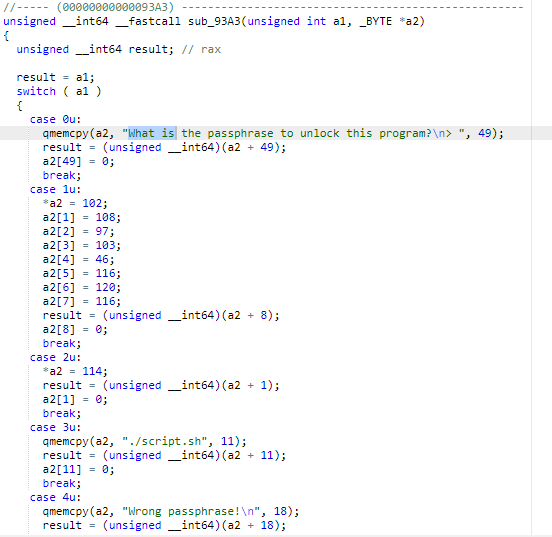

Couldn't understand anything so I checked if maybe it was packed ? 

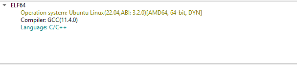

Nope, okay we'll let's use BinaryNinja then : 

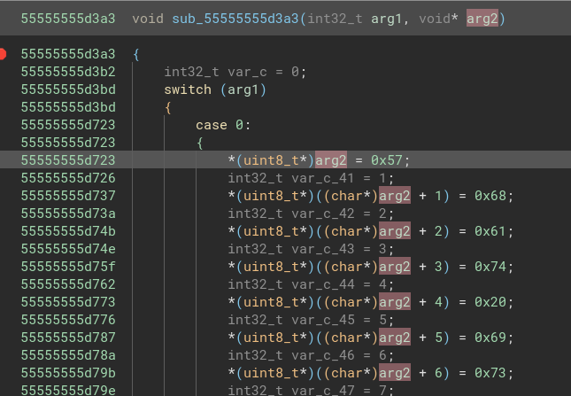

93A3 is our function, so let's set a breakpoint at the start of it and see what happens to our input : 

Before : 

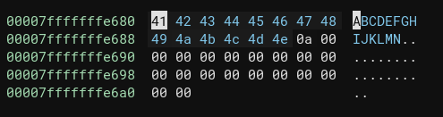

After : 

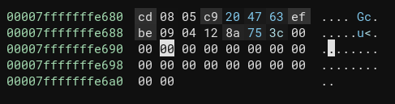

Interesting, looks like there's a mapping function, I sent another input just to make sure and it's probably the case :

Before :

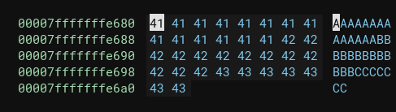

After :

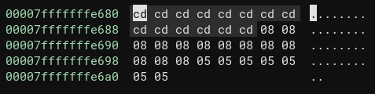

But then I got stuck

So I tried strace and saw this : 

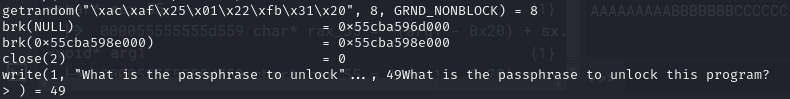

I needed to find where this happens, so I went back and checked if rand gets called

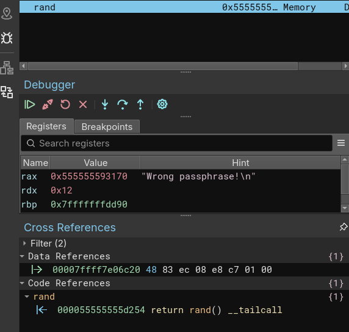

Let's put a breakpoint on rand and spam continue until I find which function calls it

and there it is : at 818e6

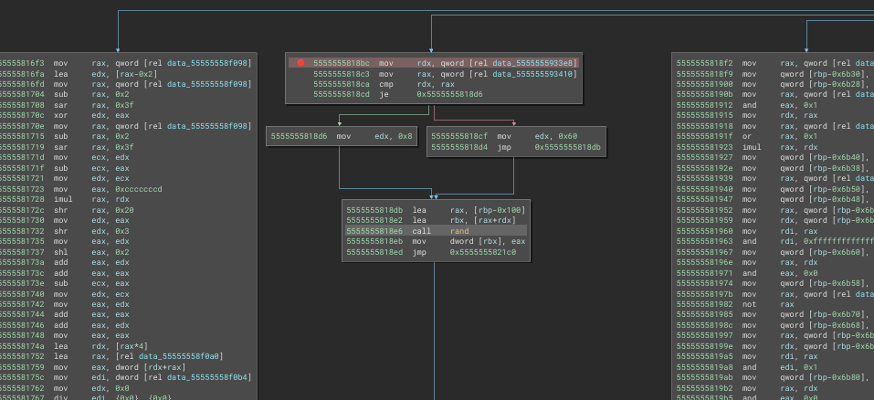

now we'll see what happens with this rand call

after spamming it after 34 times we finally stop calling rand, this probably means that the flag is 34 characters long.

What I did was make rand always return 0 and see what happens.

After trial and error, I found this line that compares our result with the expected result : 

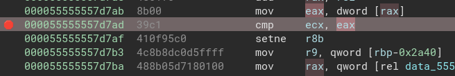

"0xcd" is our input since A turns to 0xcd and we are comparing it with 0xa5

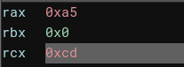

so there's probably a xor with the LSB of the rand value, let's try setting back to generating random values.

let's input "a" :

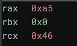

Then I wondered : how can I solve this challenge if the values are random each time yet the compared value is always the same ? so I wrote "a" again :


Same result. So it looks like I'll have to resort to the old reliable : guessing one character at a time.

After hours I finally found it : 

```wh47 15 7h3 r1ck 457l3y p4r4d0x?```

Fun.

